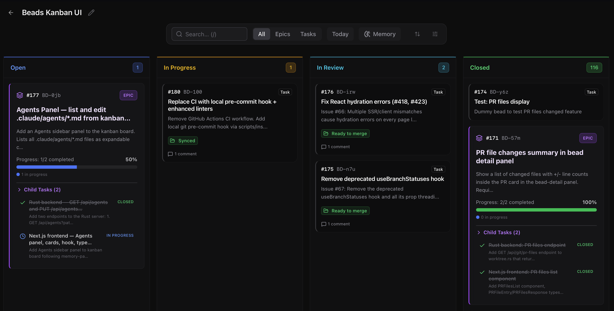

<div align="center">

# CLAUDE PROTOCOL

**Structure that survives context loss. Every task tracked. Every decision logged.**

[](https://www.npmjs.com/package/claude-protocol)
[](https://github.com/weselow/claude-protocol)
[](LICENSE)

<br>

```bash
npx claude-protocol init
```

<br>



<br>

[Why](#why) · [What Changed](#what-changed-in-v3) · [How It Works](#how-it-works) · [Installation](#installation) · [Workflow](#workflow) · [Hooks](#hooks) · [FAQ](#faq)

**[Русская версия](README-ru.md)**

</div>

---

## Why

Claude Code loses context. Plans disappear after compaction. Tasks are forgotten between sessions. Changes go straight to main with no traceability.

Claude Protocol fixes this with three things:

- **Beads** — persistent task tracking. One task = one worktree = one PR. Survives restarts and compaction.
- **Hooks** — enforcement, not instructions. Edits on main are blocked. Completion without checklist is blocked. `git --no-verify` is blocked.
- **bd prime** — session start hook loads recent beads so state survives context loss.

Constraints over instructions. What's blocked can't be ignored.

## Origin

This project started as a fork of [The Claude Protocol](https://github.com/AvivK5498/The-Claude-Protocol) by Aviv Kaplan. The original author appears to have stopped development — PRs go unreviewed, and the underlying tools (beads CLI, Claude Code hooks API) have changed significantly.

v3 is a ground-up rewrite. Different architecture, different philosophy. See [decisions.md](docs/decisions-en.md) for full rationale.

## What Changed in v3

### v3.3.0 (2026-04-22)

- **Upgrade mechanism** — new `npx claude-protocol upgrade` command with
  `--dry-run` and `--all <parent>` for batch runs across workspaces. Every
  removal is backed up to `.claude/.upgrades/<timestamp>/`.
- **Memory system removed** — `knowledge.jsonl`, `memory-capture.cjs`, and
  `recall.cjs` are gone. bd's native `bd remember` / `bd memories` takes
  over. Legacy files are cleaned up automatically during upgrade.
- **bd 1.0.2 compatibility** — bd repo moved to gastownhall; install URLs
  updated. Workflow no longer uses the obsolete `inreview` status.
- **Path traversal guard** — upgrade never writes or deletes outside the
  project directory.

Stripped everything that doesn't improve output. Added everything that does.

**Removed:**
- 5 specialized agents (Scout, Detective, Architect, Scribe, Discovery) — duplicated built-in Claude Code capabilities
- Per-tech supervisor generation — 500+ lines of context per stack, Claude already knows these technologies
- Agent personas ("Rex the reviewer") — based on outdated prompting patterns, just fills context
- MCP Provider Delegator, Kanban UI, Web Interface Guidelines — unnecessary infrastructure
- 19 bash hooks — replaced with 3 cross-platform Node.js hooks

**Added:**
- Checklist verification — hook blocks completion if requirements from description aren't checked off
- Session-start dashboard — shows what the task tracker cannot: dirty main checkout, merged PRs awaiting cleanup, worktrees left behind
- Mandatory size check — automatic decision: single bead or epic with children
- Plan-to-beads requirement — all planned tasks must be created as beads before implementation starts
- LEARNED quality enforcement — specific format: problem → solution → context
- Safe install and upgrade — SHA-256 manifest tracks user modifications, `--force` for clean reinstall
- bd command reference in rules — prevents Claude from inventing nonexistent commands

**Changed:**
- Rules are trigger-based ("when you create an API endpoint → add logging") instead of reference documents
- Knowledge base search is mandatory before every investigation
- Dev rules (implementation, logging, TDD) included by default

Full details: [docs/decisions-en.md](docs/decisions-en.md)

## How It Works

### What gets installed

```
.claude/
  agents/
    code-reviewer.md        # Adversarial 3-phase review
    merge-supervisor.md     # Conflict resolution protocol
  hooks/                    # 3 Node.js enforcement hooks + shared utils
  rules/
    beads-workflow.md       # Task lifecycle, bd command reference
    pre-code-workflow.md    # Three gates before any edit
    implementation-standard.md
    communication-style.md
    debugging-standard.md
    logging-standard.md
    tdd-workflow.md
    resilience-standard.md
  skills/
    project-discovery/      # Extracts project conventions
  settings.json             # Hook configuration
  .manifest.json            # File hashes for safe upgrades
CLAUDE.md                   # Orchestrator instructions
.beads/                     # Task database + knowledge base
```

### Safe for existing projects — and for upgrades

First install and re-install use the same command: `npx claude-protocol init`.

- **Hooks and skills** — always updated to the latest version (enforcement code).
- **Rules and agents** — updated only if you haven't modified them. Modified files are preserved; the new version is saved to `.claude/.upgrades/` for manual review.
- **CLAUDE.md** — only the block between `<!-- claude-protocol:begin -->` and `<!-- claude-protocol:end -->` is ours, and only that block is refreshed. Your overview, tech stack and current state are never touched.
- **settings.json** — hooks merged by event type. Your existing hooks stay.
- **.gitignore** — missing entries appended. Nothing removed.

Use `--force` to take our version of every file. It is not destructive either: any file whose content no longer matches the manifest is copied to `.claude/.upgrades/<path>.mine` before being overwritten.

### What happens at session start

Every time you start Claude Code, the `session-start` hook shows:

- **ACTION REQUIRED** — merged worktrees with unclosed beads, stale `inreview` tasks
- **In Progress** — beads to resume
- **Ready** — unblocked beads available for dispatch
- **Blocked / Stale** — beads waiting on dependencies or inactive for 3+ days
- **Recent Knowledge** — last 5 LEARNED entries from the knowledge base
- **Open PRs** — your PRs awaiting review

No manual checking. Context is rebuilt automatically.

### Project discovery

After installation, run `/project-discovery` in Claude Code. It scans your codebase and writes `.claude/rules/project-conventions.md` with:

- Tech stack and frameworks detected
- Naming conventions and patterns
- Testing setup and commands
- Anti-patterns specific to your project

This file is auto-loaded into every agent context. No per-tech supervisor generation needed.

## Installation

### Prerequisites

- Python 3.11+
- Node.js 20+
- git

### Install

```bash
npx claude-protocol init
```

Restart Claude Code. Run `/project-discovery`.

### Options

| Flag | Description |
|------|-------------|
| `--project-dir PATH` | Target directory (default: current) |
| `--project-name NAME` | Project name for CLAUDE.md (auto-inferred from package.json / pyproject.toml / Cargo.toml / go.mod) |
| `--no-rules` | Skip dev rules (implementation, logging, TDD, resilience) |
| `--lang en\|ru` | Language for dev rules (default: en) |
| `--force` | Take our version of every file, no questions asked (yours is kept in `.claude/.upgrades/`) |
| `--keep-mine` | Keep your version of every file you edited, no questions asked |

### Local development (before npm publish)

```bash
cd /path/to/claude-protocol && npm link
npx claude-protocol init  # works in any project
```

## Upgrade

Existing projects upgrade safely: only claude-protocol's own artifacts are
cleaned up, and every removal is backed up first.

When a file you edited also changed on our side, the upgrade asks — per file,
with a diff on request, and `K`/`T` to answer for all the rest at once. The
version you do not choose is kept next to the file under `.claude/.upgrades/`,
so nothing you wrote is ever lost. Where no one can answer — batch upgrades,
CI, an agent driving the CLI — your files are kept and ours are saved beside
them. `--force` and `--keep-mine` answer for every file up front.

**CLAUDE.md is different: it is yours, and only a marked block inside it is
ours.** Everything between `<!-- claude-protocol:begin -->` and
`<!-- claude-protocol:end -->` is replaced on upgrade; the project overview,
tech stack and current state around it are never read, never rewritten. A
project installed before the markers existed is asked once — with a diff —
whether to mark the block it already carries. Say no and nothing changes: the
current template lands in `.claude/.upgrades/CLAUDE.md`, exactly as before.

### Preview (recommended first)

```bash
npx claude-protocol@latest upgrade --dry-run
```

Prints the exact list of files, directories, and settings-hook entries that
would change, and writes nothing at all — every line of the preview is
prefixed `[DRY-RUN]`.

### Apply

```bash
npx claude-protocol@latest upgrade
```

Runs the init flow and then strips obsolete artifacts. Every removal is
backed up under `.claude/.upgrades/<UTC-timestamp>/` so you can roll back by
copying files out of the backup directory.

### Batch (multiple projects)

```bash
npx claude-protocol@latest upgrade --all /path/to/parent
```

Iterates every direct subdirectory of the parent that contains a `.beads/`
folder and upgrades each one. Combine with `--dry-run` to audit before
applying.

### Rollback

The backup directory `.claude/.upgrades/<timestamp>/obsolete/` mirrors the
project tree. Copy the file(s) you want back into place. Nothing is ever
hard-deleted.

## Workflow

### Every task goes through beads

```
Plan → Size check → Create beads → bd ready → Dispatch → Worktree → PR → Merge → Close
```

**Size check** runs automatically before creating beads:
- More than 3 files or multiple domains (DB + API + frontend) → epic with children
- More than 50 lines estimated → consider splitting
- Otherwise → single bead

One bead = one worktree = one PR = one reviewable diff.

### Parallel work

```bash
bd dep add TASK-2 TASK-1    # TASK-2 is blocked by TASK-1
bd close TASK-1              # TASK-2 becomes ready
bd ready                     # shows all unblocked tasks
```

Orchestrator dispatches all ready tasks in parallel via `Task()`.

### Quick fix

For changes under 10 lines on a feature branch. Hard blocked on main.

```bash
git checkout -b fix-typo     # must be off main
# edit → commit
```

### Completion verification

Subagents are blocked from finishing unless:
- `Checklist:` section present with all `[x]` items checked
- Bead status set to `inreview`
- Code committed and pushed
- Comment left on bead
- Response within verbosity limits (25 lines / 1200 chars)

## Hooks

| Hook | Event | Enforcement |
|------|-------|-------------|
| bash-guard | PreToolUse (Bash) | Blocks `--no-verify` and raw `git worktree add`. Requires description on `bd create`. Validates epic close (all children done, PR merged). Every command in a chain is checked, not just the first. |
| validate-completion | SubagentStop | Checks worktree, push, status, checklist, comment, verbosity. |
| session-start | SessionStart | Dirty main checkout, worktrees of merged branches, open PRs. Task listing is left to `bd prime`. |
| hook-utils | — | Shared utilities: project-dir resolution, command splitting, deny/ask/block, execCommand. |

Hook commands resolve `.claude/hooks/` from `CLAUDE_PROJECT_DIR` rather than a relative
path: a hook process inherits the working directory of the last Bash call, so a relative
path stops resolving as soon as work moves into a subdirectory — and Claude Code reports
that as non-blocking, leaving the hook silently absent.

## Dev Rules

Included by default. Skip with `--no-rules`. Russian version: `npx claude-protocol init --lang ru`.

| Rule | What it does |
|------|-------------|
| pre-code-workflow | Trigger-based: three gates before touching code — entry points and an understanding table, reuse-or-write with `file:line` risks, a 7–15 item plan with an explicit out-of-scope section. Hands off to beads-workflow once the plan is accepted. |
| implementation-standard | Applies while writing code. Metrics (function < 30 lines, class < 200, nesting < 4). Rule of 3 alternatives. Self-review with `/simplify` trigger. |
| communication-style | Trigger-based: fires before every reply. Plain words over jargon, explain a term at first use, numbers instead of adjectives. |
| debugging-standard | Trigger-based: "the same error survived a deliberate fix" → stop repeating, search memory, read the source, then three alternatives. |
| logging-standard | Trigger-based: "creating API endpoint → add logging". Covers external calls, payments, auth, background jobs. Sentry + Seq. |
| tdd-workflow | Trigger-based: "new function → write test first". RED → GREEN → REFACTOR cycle. Clear exceptions (configs, DTOs, migrations). |
| resilience-standard | Trigger-based: "calling external API → what if timeout/5xx?". Covers DB, payments, files, background jobs. Strategies: retry, fallback, circuit breaker, compensation. |

## FAQ

**Q: `bd init` hangs during installation.**
A: Dolt server is not running. Bootstrap creates `.beads/` manually after 15s timeout. Run `bd init` later when Dolt is available, or use SQLite backend.

**Q: Hooks don't work after installation.**
A: Restart Claude Code. Hooks load from `settings.json` at startup.

**Q: Claude invents commands like `bd export`.**
A: `beads-workflow.md` includes a full command reference table. If Claude still invents commands, it didn't read the rules — check that `.claude/rules/` exists.

**Q: What happens if I run `init` again after updating claude-protocol?**
A: Rules and agents you edited become a question, one file at a time, with a diff on request; the version you do not pick is kept under `.claude/.upgrades/`. Hooks and skills are always updated. In CLAUDE.md only our marked block is refreshed — the rest of the file stays yours. `--force` and `--keep-mine` answer for everything up front.

**Q: Can I use this without Dolt?**
A: Yes. Beads works with SQLite by default. Dolt adds version history and branching for the task database.

## Credits

- [The Claude Protocol](https://github.com/AvivK5498/The-Claude-Protocol) by Aviv Kaplan — original project
- [beads](https://github.com/steveyegge/beads) by Steve Yegge — git-native task tracking
- [`/simplify`](https://github.com/anthropics/claude-code-skills) by Boris Cherny — code simplification skill

## License

MIT
